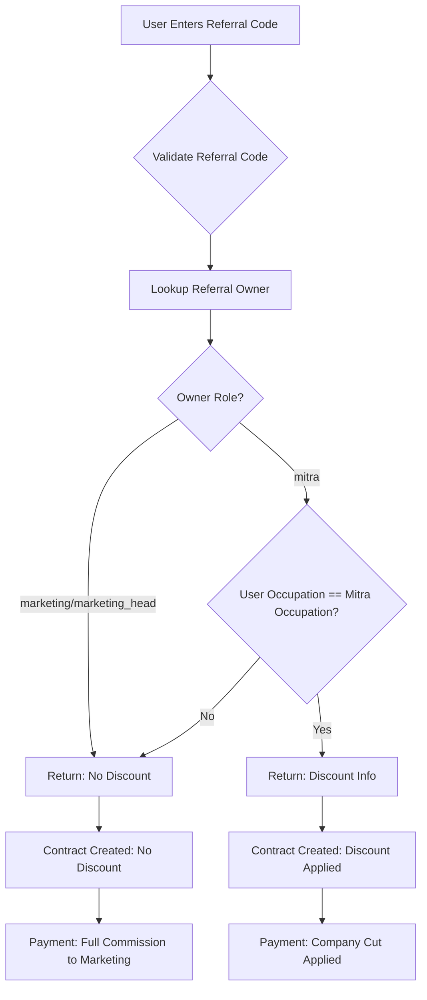

# Mitra Role and Occupation-Based Discount System

## Overview

This plan implements a new `mitra` role system where:

- **Case 1**: Normal users (occupations NOT in any mitra role) using marketing/head marketing referral codes → No discount, full commission to marketing, company cut input hidden
- **Case 2**: Special users (occupations matching mitra role) using mitra referral code (where occupation matches) → Discount applies, company cut applies, company cut input shown

## Current vs New Behavior

### Current Behavior

- SPPG/TNI users get discount when using ANY referral code (marketing/head marketing)
- Discount = commission rate
- Company cut always shown if set

### New Behavior

- SPPG/TNI users ONLY get discount when using a `mitra` referral code where mitra's occupation matches user's occupation
- Marketing/head marketing referral codes: No discount, no company cut
- Mitra referral codes with matching occupation: Discount applies, company cut applies

## Implementation Tasks

### Phase 1: Data Model Changes

**1.1 Add `mitra` role to User model**

- File: `src/models/User.ts`
- Add `'mitra'` to role enum (line 207)
- Update TypeScript interface (line 34)

**1.2 Update role references**

- File: `src/types/admin.ts` (if needed)
- File: `src/middleware.ts` (if role-based routing exists)
- Any other files that reference role enums

### Phase 2: Referral Code Validation API

**2.1 Update referral validation endpoint**

- File: `src/app/api/referral/validate/route.ts`
- Current: Checks if user is SPPG/TNI and returns discount for ANY referral code
- New logic:

  1. Lookup referral code owner (can be `marketing`, `marketing_head`, or `mitra`)
  2. If owner is `mitra`:

     - Check if user's occupation matches mitra's occupation
     - If match: Return discount info (same as current SPPG logic)
     - If no match: Return validation success but NO discount

  1. If owner is `marketing` or `marketing_head`:

     - Return validation success but NO discount (regardless of user occupation)

  1. Add `referralCodeType` to response: `"marketing" | "mitra" | "marketing_head"`
  2. Add `isMitraMatch` flag when mitra referral code is used

**Response format changes:**

```typescript
{
  success: true,
  message: 'Kode referral valid',
  marketingStaffName: string,
  referralCodeType: 'marketing' | 'mitra' | 'marketing_head',
  isMitraMatch?: boolean, // Only present for mitra codes
  discountInfo?: { // Only present if mitra match
    isSppgUser: true,
    discountPercentage: number,
    discountLabel: string
  }
}
```

### Phase 3: Contract Creation API

**3.1 Update contract creation logic**

- File: `src/app/api/contract/create/route.ts`
- Current: Lines 102-131 check if user is SPPG/TNI and apply discount
- New logic:

  1. Lookup referral code owner (lines 102-106)
  2. Update query to include `mitra` role: `role: { $in: ["marketing", "marketing_head", "mitra"] }`
  3. Store referral code owner's role in contract (optional, for audit)
  4. Discount eligibility (replace lines 122-131):
     ```typescript
     // Only apply discount if:
     // 1. Referral code owner is 'mitra'
     // 2. User's occupation matches mitra's occupation
     // 3. Commission rate > 0
     if (
       marketingUser.role === 'mitra' &&
       user.occupation === marketingUser.occupation &&
       lockedCommissionRate !== undefined &&
       lockedCommissionRate > 0
     ) {
       isSppgDiscount = true;
       discountPercentage = lockedCommissionRate;
       discountAmount = Math.round(originalAmount * discountPercentage);
       finalAmount = originalAmount - discountAmount;
     }
     ```

  1. Company cut logic:

     - Only set `lockedCompanyCutRate` if discount is applied (mitra match)
     - For marketing/head marketing: `lockedCompanyCutRate = undefined`

### Phase 4: Commission Calculation Updates

**4.1 Update webhook commission logic**

- File: `src/app/api/payment/webhook/route.ts`
- Current: Lines 540-561 handle SPPG transactions
- Changes:
  - Company cut split only applies if `isSppgDiscount === true` AND `companyCutRate !== undefined`
  - This should already work correctly, but verify logic

**4.2 Update payment processor**

- File: `src/lib/payment-processor.ts`
- Same verification as webhook - ensure company cut only applies for mitra matches

**4.3 Update commission utility**

- File: `src/lib/commission.ts`
- Verify company cut logic is correct

### Phase 5: Marketing Page UI Updates

**5.1 Update staff list API**

- File: `src/app/api/admin/marketing/staff/route.ts`
- Current: Fetches users with role `marketing` or `marketing_head`
- New: Also fetch users with role `mitra`
- Add `occupation` field to response for mitra users
- Update query: `role: { $in: ['marketing', 'marketing_head', 'mitra'] }`

**5.2 Update marketing page display**

- File: `src/app/marketing/page.tsx`
- Add occupation column for mitra users
- Show role badge (Marketing / Mitra)
- Update `MarketingStaff` interface to include `role` and `occupation?`

**5.3 Update commission settings modal**

- File: `src/app/marketing/page.tsx` (commission settings modal)
- Current: Always shows company cut input
- New logic:
  - If staff role is `marketing` or `marketing_head`: Hide company cut input
  - If staff role is `mitra`: Show company cut input
  - Update validation: Company cut only validated for mitra role

**5.4 Update commission settings API**

- File: `src/app/api/admin/marketing/referral-settings/route.ts`
- Current: Lines 38-43 check for `marketing` or `marketing_head`
- New: Also allow `mitra` role
- Update validation: Company cut can only be set for `mitra` role

### Phase 6: Customer Checkout UI Updates

**6.1 Update PlantShowcaseSection**

- File: `src/components/landing/PlantShowcaseSection.tsx`
- Current: Shows discount if `discountInfo?.isSppgUser`
- New: Use `discountInfo` from API response (only present for mitra matches)
- No code changes needed if API response is correct

**6.2 Update CicilanModal**

- File: `src/components/landing/CicilanModal.tsx`
- Same as PlantShowcaseSection - should work automatically with API changes

### Phase 7: Admin/Staff Management

**7.1 Update staff creation API**

- File: `src/app/api/admin/staff/route.ts`
- Add `mitra` to allowed roles
- Generate referral code for `mitra` role (similar to marketing_head)
- Store occupation for mitra users

**7.2 Update staff management UI**

- File: `src/app/admin/staff/page.tsx` (if exists)
- Add `mitra` role option in role dropdown
- Show occupation field when `mitra` role is selected

## Data Flow Diagram



## Validation Rules Summary

### Referral Code Validation

- Marketing/head marketing codes: Always valid, never provide discount
- Mitra codes: Valid if active, provide discount ONLY if user occupation matches mitra occupation

### Discount Eligibility

- **Case 1** (Normal users + marketing codes): No discount, full commission
- **Case 2** (Special users + matching mitra codes): Discount = commission rate, company cut applies

### Company Cut Visibility

- Marketing/head marketing: Company cut input HIDDEN in UI
- Mitra: Company cut input SHOWN in UI

## Files to Modify

1. `src/models/User.ts` - Add mitra role
2. `src/app/api/referral/validate/route.ts` - Update validation logic
3. `src/app/api/contract/create/route.ts` - Update discount eligibility
4. `src/app/api/admin/marketing/staff/route.ts` - Include mitra in queries
5. `src/app/api/admin/marketing/referral-settings/route.ts` - Allow mitra, conditional company cut
6. `src/app/marketing/page.tsx` - Update UI for mitra display, conditional company cut input
7. `src/app/api/admin/staff/route.ts` - Allow mitra role creation
8. `src/lib/payment-processor.ts` - Verify commission logic (should already work)
9. `src/app/api/payment/webhook/route.ts` - Verify commission logic (should already work)

## Testing Checklist

- [ ] Create mitra user with occupation "sppg"
- [ ] Create mitra user with occupation "tni"
- [ ] Normal user (non-sppg/tni) using marketing referral code → No discount
- [ ] SPPG user using marketing referral code → No discount
- [ ] SPPG user using mitra (sppg) referral code → Discount applied
- [ ] SPPG user using mitra (tni) referral code → No discount (occupation mismatch)
- [ ] TNI user using mitra (tni) referral code → Discount applied
- [ ] Company cut input hidden for marketing/head marketing in UI
- [ ] Company cut input shown for mitra in UI
- [ ] Commission calculation correct for both cases